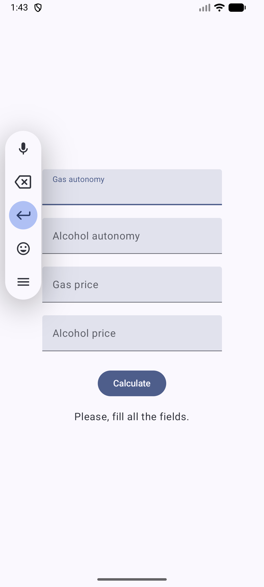
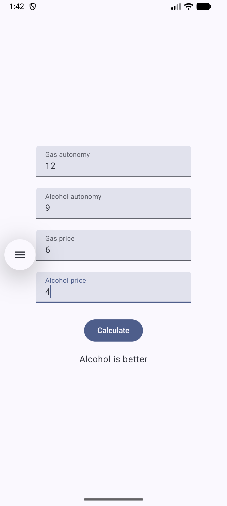
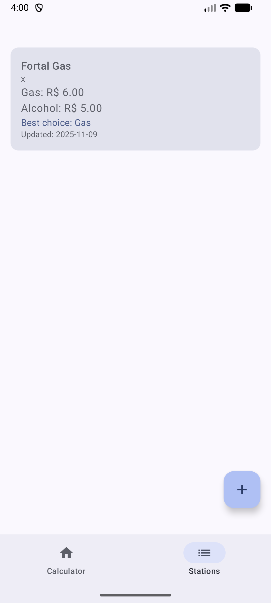
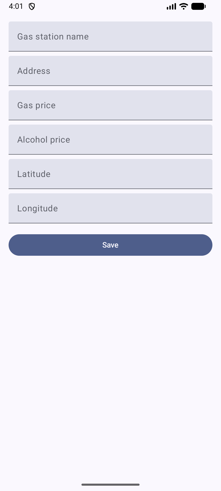
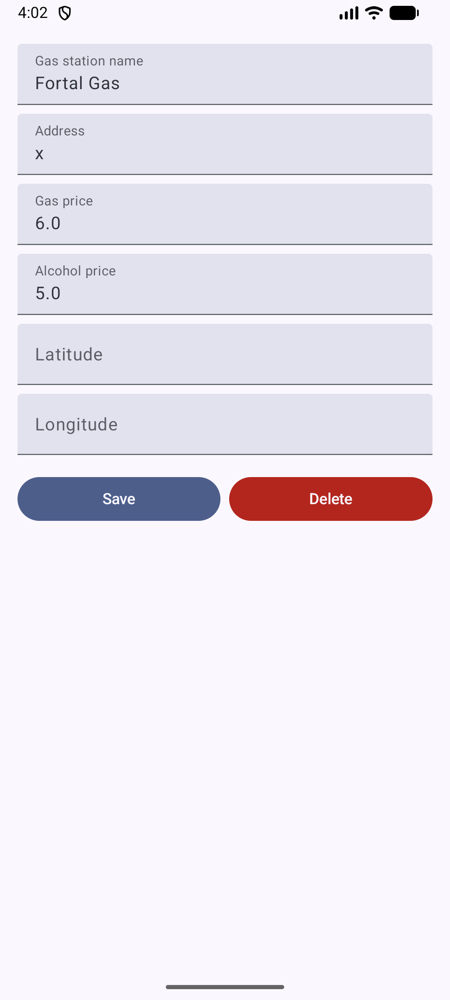

# ⛽ GasOrAlcohol

Aplicativo Android simples para ajudar motoristas de veículos flex a decidir entre gasolina e álcool.

## 🚀 Funcionalidades

### 1. Calculadora de Combustível
Calcule qual combustível é mais vantajoso baseado na autonomia do seu veículo:
- Insira a autonomia com gasolina (km/L)
- Insira a autonomia com álcool (km/L)
- Insira os preços atuais
- Veja instantaneamente qual é melhor

### 2. Gerenciamento de Postos
Salve e gerencie informações de postos de gasolina:
- **Lista de postos**: Veja todos os postos salvos com preços e recomendação
- **Adicionar posto**: Salve nome, endereço, preços, latitude e longitude
- **Editar posto**: Atualize informações de postos existentes
- **Excluir posto**: Remova postos da lista
- **Cálculo automático**: O app mostra automaticamente qual combustível é melhor em cada posto (baseado na regra dos 70%)

### 3. Persistência de Dados
- Dados salvos localmente usando **SharedPreferences**
- Serialização com **Gson** para armazenar objetos complexos
- Estado dos postos é restaurado ao abrir o app

### 4. Internacionalização
- Suporte para Português (BR) e Inglês
- Strings centralizadas em `res/values/strings.xml`

## 🛠️ Tecnologias

- **Kotlin** - Linguagem principal
- **Jetpack Compose** - UI declarativa
- **MVVM** - Arquitetura
- **StateFlow** - Gerenciamento de estado
- **SharedPreferences** - Persistência local
- **Gson** - Serialização JSON
- **Material 3** - Design system

## 👨‍🎓 Informações Acadêmicas

- **Aluno**: Rodrigo Rodrigues Santos
- **Matrícula**: 539105
- **Instituição**: Universidade Federal do Ceará
- **Curso**: Ciência da Computação
- **Disciplina**: Programação para Dispositivos Móveis
- **Professor**: Windson Viana

## ⚙️ Como Executar

1. Clone o repositório
2. Abra no Android Studio
3. Sincronize o Gradle
4. Execute no emulador ou dispositivo físico
